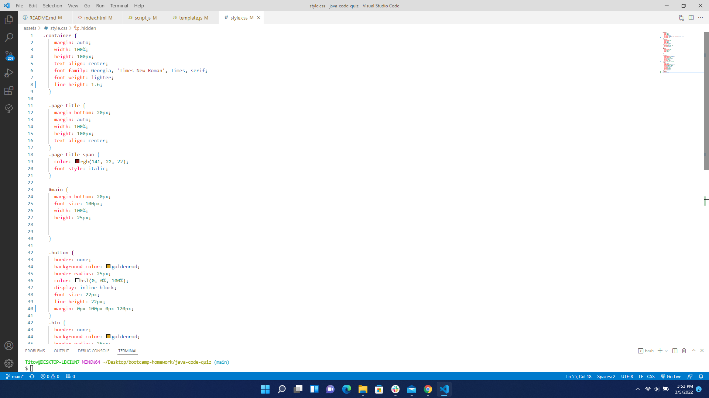
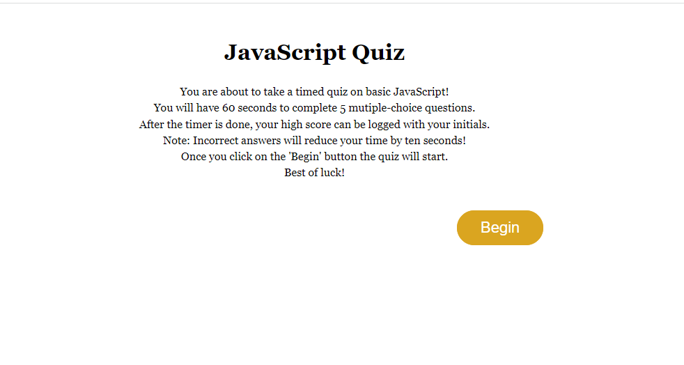

# JavaScript Quiz

## Purpose:
 * To built a JavaScript-powered, multiple-choice, timed quiz for users and log high scores

  ## Table of Contents:
1. [ Description ](#desc)
2. [ Built With ](#built-with)
3. [ Steps ](#steps)
4. [ Link to my page ](#link-to-my-page)
5. [ Helpful Links ](#help)

 ## 1. Description
  * A user is given a timed mutiple choice quiz on JavaScript.
  * Once the timer begins, they are prompted to choose the correct answer for 5 questions.
  * If the user gets a question wrong, they are reduced time by ten seconds.
  * If their answer is correct, they move on. 
  * Once the timer is at 0, or if the the user finishes before 120 seconds, the score gets logged and the user can type in their initials.

 ## 2. Built With
  * CSS
  * HTML
  * JavsScript

 ## 3. Steps
 First, the HTML is set up the classes in the < div> must match up with the CSS properties.

 
 

 Then the JavaScript is set up with variables to match up to corresponding functions.
 

A JS template allows the back ticks (``) to pull up the whole section to return information on a page.
Back tick literals, as they are called, signal the JavaScript parser to look for multi-line strings. Template literals make the JS cleaner when requesting an API, and just storing them in another .js file. I linked it right before the main JS file in HTML using < script>. 
<!-- //</header></body>// -->

 

 Timer is set at 2 minutes once the user clicks 'Begin', and starts counting down as they choose their answer.
 

 The user navigates through the quiz choosing the answers they think are correct. 
 If they choose a correct answer, the JavaScript code shows that the 'onclick' for answer chosen as well as the right and wrong answers. If the quiz taker answers wrong,
 then the 'if' statement holds how the javaScript handles a wrong answer logging in +1 incorrect and also taking away ten seconds with every incorrect answer.
  
  

Once the timer is up, or the user is done taking the test they are taken to the Scores page after clicking 'Submit.
  

 From that page they can either exit or restart the test by clicking 'Restart' or refreshing the page.
 

 
 ## 4. Link To Project in My Github Pages:

[My JavaScript Quiz](https://verokoles.github.io/java-code-quiz/)

 ## 5. Helpful Links
* [JSON Stringify JavaScript](https://developer.mozilla.org/en-US/docs/Web/JavaScript/Reference/Global_Objects/JSON/stringify)
* [jQuery APIs](https://api.jquery.com/)
* [JavaScript HTML DOM](https://www.w3schools.com/js/js_htmldom.asp)
* [Pointers on making a JavaScript powered quiz from scratch](https://simplestepscode.com/javascript-quiz-tutorial/#:~:text=The%20following%20JavaScript%20will%20make%20that%20happen%3A%20%2F%2F,the%20parameters.%20Step%204%3A%20Put%20it%20all%20together)
* [Onclick and Evnet Listeners](https://www.bitdegree.org/learn/onclick-javascript)
* [Usage of Back Ticks `` in JavaScript](https://thebittheories.com/the-3-advantages-of-backtick-literals-in-javascript-f6beade4a9cf)
